# Behavioral Cloning
*Author:* **Pawel Piela**
*Date:* **30/4/2018**

## Project

The goal of this project is to write a lane detection pipelane which consists of the following steps:

- Calculate a distortion matrix to undistort camera images,
- Preprocess the image using color spaces transformations and/or gradients with thresholding,
- Warp the perspective,
- Detect lane side lines,
- Fit polynomials that fit left and right side of the lane,
- Draw the ROI,
- Unwarp the perspective,

## Calibrating the camera

I use `cv2.findChessboarCorners` function to detect corners in the distorted images and compare them against their real position in euclidean R3 space. Then I use `cv2.calibrateCamera` function to calculate camera and distortion matrices.

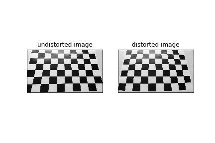

|**Original Image**|**Undistorted Image**|
|-|-|
||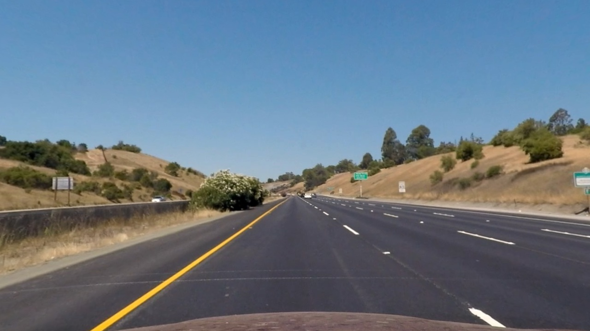|

## Preprocessing

In my pipeline I convert the image to YCrCb and YUV color space. I use Sobel in XY directrion (1,1) to detect the edges in the Y channel of the YCrCb image, Y channel of the YUV image and R channell of the RGB image. I threshold and binarize them together and perform biary 'or' operation to create the final binarized image. 

**Test Image**

**YCrCb Color Space**

*Y Channel*

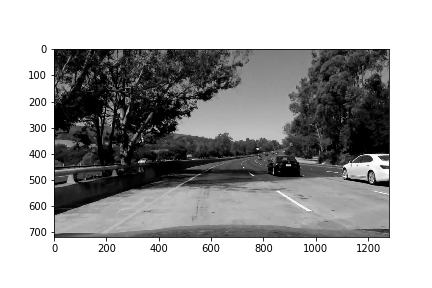

*Sobel applied in XY direction and threshholded*

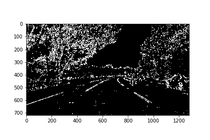

**YUV Color Space**

*Y Channel*

*Thresholded and binarized*

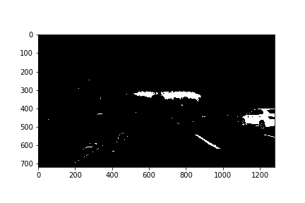

**RGB Color Space**

*R Channel*

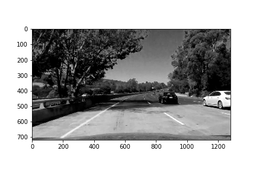

*Thresholded and binarized*

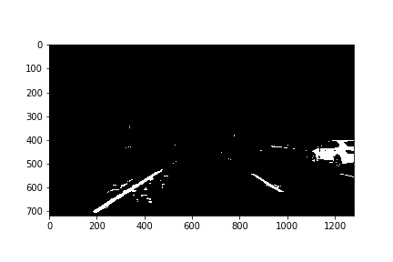

**Combined Image**

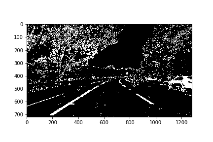

## Warping the perspective

I use undistorted straing lane image to determine the region of interest:

Using a method of trial and error I tried to find right region of interest corners to make lane look straight on the warped image:

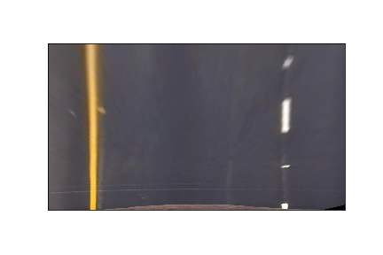

The ROI cannot go too far forward because distortion of the image at the top of the warped image makes it very error prone.

## Detecting the lane sides

I use the bottom half of the image to determine the bottoms of the lane sides. After that I slice the image into `nsegments` slices and starting from initial guess I make my way up (in the natural sense) the image. I compute histograms of every slice and update the position of the middle of the lane at every step. If dominant histogram peak on the left or right side of the lane  does not satisfy some certain conditions (like relative poisition to the last valid point, minimum pixel count etc.) I reject it and try another peak.

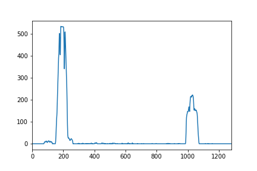

Once the lanes points are determined I fit the polynomials of the 2nd degree for the left and right side of the lane:

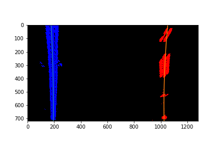

## Discussion

Even though this pipeline successfully detects the lane on the moderately undamaged road with clearly indicated sides of the lane (i.e. a speedway) it cannot be relied upon in some more tough conditions, i.e. damaged roads with worn out lines or roads with different colors of a surface next to each other along the flow of the traffic. Also the radius of curvature cannot be less than couple of hundreds of meters. One of the solutions to the issue related to the curvature of the road can be solved by adaptive region of interest, which shortens and goes towards the direction of the curvature. Improved lane detection can be achieved by using deep learning networks trained to distinguish a real line from some other road artefacts.

## -> Final Result [Youtube](https://youtu.be/tKYuUuMsROI) <- ## 